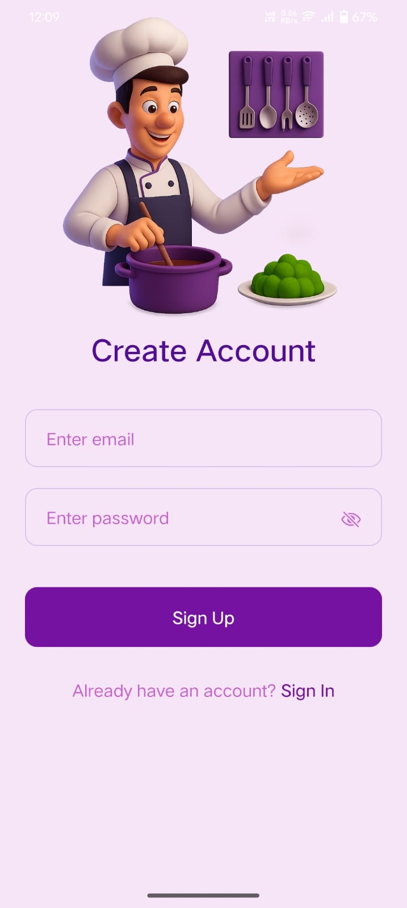
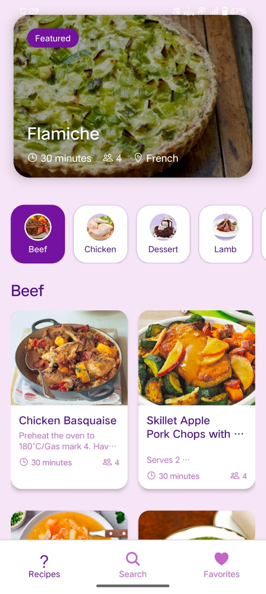
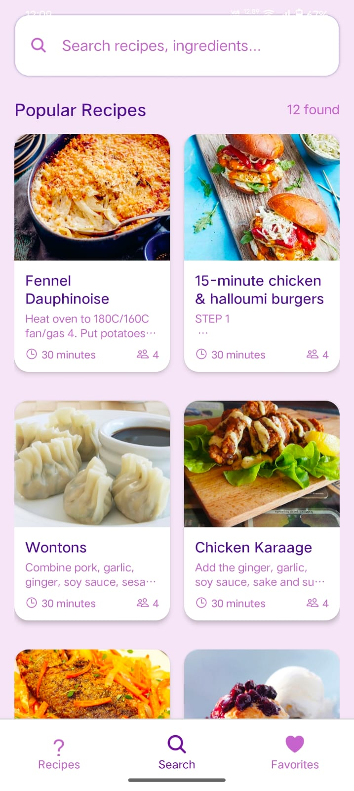
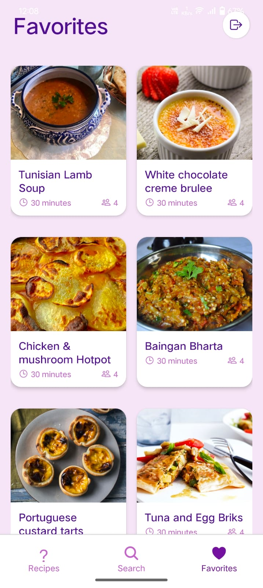

# ️ Recipe App Mobile

A beautiful and feature-rich mobile recipe application built with React Native and Expo, featuring modern UI/UX design, recipe management, and user authentication.


## ✨ Features

- 🔐 **Secure Authentication** - Built with Clerk for seamless user management
- 🔗 **Recipe Discovery** - Browse thousands of recipes from TheMealDB API
- ❤️ **Favorites System** - Save and organize your favorite recipes
- 🔍 **Smart Search** - Find recipes by ingredients, cuisine, or name
- 🌐 **Cross-Platform** - Works on iOS, Android, and Web
- 🎨 **Modern UI/UX** - Beautiful design with smooth animations
- 🎥 **Video Tutorials** - YouTube integration for cooking guidance

## 📱 Screenshots

### Authentication Screens
| Login Screen | Sign Up Screen |
|--------------|----------------|
|  |  |

### Main App Screens
| Recipe Screen | Search Screen | Favorites Screen |
|---------------|----------------|------------------|
|  |  |  |

## 🚀 Quick Start

### Prerequisites

- Node.js (v18 or higher)
- npm or yarn
- Expo CLI (`npm install -g @expo/cli`)
- iOS Simulator (for iOS development)
- Android Studio (for Android development)

### Installation

1. **Clone the repository**
   ```bash
   git clone <your-repo-url>
   cd FullStack-Recipe-App/mobile
   ```

2. **Install dependencies**
   ```bash
   npm install
   # or
   yarn install
   ```

3. **Set up environment variables**
   ```bash
   # Create .env file in the mobile directory
   cp .env.example .env
   # Edit .env with your Clerk publishable key
   ```

4. **Start the development server**
   ```bash
   npm start
   # or
   expo start
   ```

5. **Run on your device**
   - **iOS**: Press `i` in the terminal or scan QR code with Camera app
   - **Android**: Press `a` in the terminal or scan QR code with Expo Go app
   - **Web**: Press `w` in the terminal

## 📁 Project Structure

```
mobile/
├── app/                    # App screens and navigation
│   ├── (auth)/            # Authentication screens
│   │   ├── sign-in.jsx    # Login screen
│   │   ├── sign-up.jsx    # Registration screen
│   │   └── verify-email.jsx # Email verification
│   ├── (tabs)/            # Main app tabs
│   │   ├── index.jsx      # Home/Recipes screen
│   │   ├── favorites.jsx  # Favorites screen
│   │   └── search.jsx     # Search screen
│   ├── recipe/            # Recipe details
│   │   └── [id].jsx      # Dynamic recipe page
│   └── _layout.jsx        # Root layout
├── assets/                 # Static assets
│   ├── images/            # App icons and images
│   ├── screensort/        # App screenshots
│   ├── styles/            # Component styles
│   └── fonts/             # Custom fonts
├── components/             # Reusable components
│   ├── RecipeCard.jsx     # Recipe card component
│   ├── LoadingSpinner.jsx # Loading indicator
│   └── NoFavoritesFound.jsx # Empty state component
├── constants/              # App constants
│   ├── api.js             # API configuration
│   ├── colors.js          # Color themes
│   └── theme.js           # Theme configuration
├── hooks/                  # Custom React hooks
├── services/               # API services
│   └── mealAPI.js         # TheMealDB API integration
└── types/                  # TypeScript type definitions
```

## 🎨 Design System

### Color Themes
The app features multiple beautiful color themes:

- **Coffee Theme** - Warm browns and creams
- **Forest Theme** - Natural greens and earth tones
- **Purple Theme** - Rich purples and violets
- **Ocean Theme** - Cool blues and teals
- **Sunset Theme** - Warm oranges and pinks
- **Mint Theme** - Fresh mint and teal
- **Midnight Theme** - Dark grays and blues
- **Rose Gold Theme** - Elegant rose and gold

### Typography
- **Headings**: Bold, large fonts for titles
- **Body Text**: Readable, medium-weight fonts
- **Captions**: Light, smaller fonts for secondary information

## 🔧 Configuration

### Environment Variables
Create a `.env` file in the mobile directory:

```env
EXPO_PUBLIC_CLERK_PUBLISHABLE_KEY=your_clerk_publishable_key
API_URL=http://your-backend-url/api
```

### Clerk Authentication
The app uses Clerk for user authentication. Set up your Clerk account and add the publishable key to your environment variables.

## 📱 Available Scripts

```bash
# Start development server
npm start

# Start with specific platform
npm run ios          # iOS simulator
npm run android      # Android emulator
npm run web          # Web browser

# Lint code
npm run lint

# Reset project (clears cache)
npm run reset-project
```

## 🚀 Building for Production

### iOS
```bash
expo build:ios
```

### Android
```bash
expo build:android
```

### Web
```bash
expo build:web
```

## 🔌 API Integration

### TheMealDB API
- **Base URL**: `https://www.themealdb.com/api/json/v1/1`
- **Endpoints**: 
  - Search recipes
  - Get recipe details
  - Get random recipes
  - Filter by category/ingredient

### Backend API
- **Health Check**: `/api/health`
- **Favorites**: `/api/favorites`
- **User Favorites**: `/api/favorites/:userId`

## 🎯 Key Components

### RecipeCard
A beautiful, interactive card component that displays recipe information with:
- Recipe image
- Title and category
- Cook time and servings
- Save to favorites functionality

### Recipe Details
Comprehensive recipe information including:
- High-quality images
- Ingredient lists with measurements
- Step-by-step instructions
- Video tutorials (YouTube integration)
- Save/unsave functionality

### Search & Filter
Advanced search capabilities:
- Search by recipe name
- Filter by cuisine type
- Filter by ingredients
- Real-time search results

## 🧪 Testing

```bash
# Run tests
npm test

# Run tests with coverage
npm run test:coverage

# Run specific test file
npm test -- --testPathPattern=RecipeCard
```

## 📦 Dependencies

### Core Dependencies
- **React Native**: Mobile app framework
- **Expo**: Development platform and tools
- **Expo Router**: File-based routing
- **Clerk**: Authentication service

### UI & Animation
- **Expo Linear Gradient**: Beautiful gradient effects
- **Expo Image**: Optimized image loading
- **React Native Reanimated**: Smooth animations
- **Expo Haptics**: Tactile feedback

### Development Tools
- **TypeScript**: Type safety
- **ESLint**: Code quality
- **Expo Dev Tools**: Development utilities

## 🌟 Contributing

1. Fork the repository
2. Create a feature branch (`git checkout -b feature/amazing-feature`)
3. Commit your changes (`git commit -m 'Add amazing feature'`)
4. Push to the branch (`git push origin feature/amazing-feature`)
5. Open a Pull Request

## 📄 License

This project is licensed under the MIT License - see the [LICENSE](LICENSE) file for details.

## 🤝 Support

If you encounter any issues or have questions:

1. Check the [Issues](https://github.com/your-username/your-repo/issues) page
2. Create a new issue with detailed information
3. Contact the development team

## 🎁 Acknowledgments

- **TheMealDB** for providing the recipe API
- **Expo** for the amazing development platform
- **Clerk** for authentication services
- **React Native** community for continuous support

---

**Happy Cooking! ✨**

*Built with ❤️ using React Native and Expo*